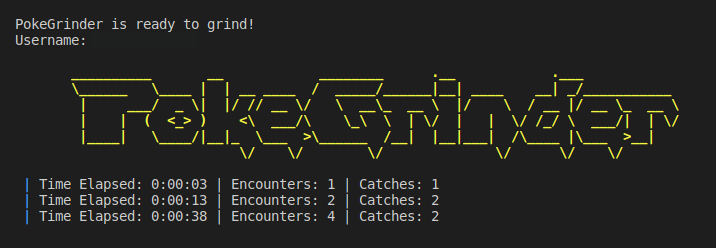

# PokeGrinder-V2
An Auto-Grinding Self-Bot for the Discord Bot PokéMeow. As efficient as can be.

## Supported Features
1. Hunting
- Encounters Pokemons and uses a ball depending on the rarity of the Pokemon.
- Stops if a captcha appears and automatically continues after the captcha is solved.
- Logs elapsed time, encounters and catches.

2. Captcha Solver
- Solves captchas automatically under 2-3 seconds (depending on your CPU).
- Has an accuracy of ~98.7% with 290 layers and 20,889,303 parameters.
- Retry when incorrect so cant almost imposible to get ban
- Free forever!
3. Auto Buy Balls
- Buys balls automatically when you run out of them!
- Amount of balls to buy can be specified in `config.json`.

## Upcoming Features
1. Fishing
3. Auto Release Duplicates
4. Auto Checklist

## Installating

### Without Executable (I dont have it for now.)
1. Install Python 3.8 or higher.
2. Install Git from https://git-scm.com/downloads
3. Open cmd run `git clone https://github.com/lufy20106/PokeGrinder-V2/`
6. Inside of the repository run command `python -m pip install -r requirements.txt`
7. Paste your Discord Auth Token, User ID and the Channel ID you want to grind in inside `config.json`.
8. You may also edit the rarities section in `config.json` according to your convenience.

## Launching 
1. Run `start.cmd` or the `main.py` file.
2. Please buy at least 1 ball for each rarity specified in the config before starting.
3. The bot will take some time (depending on your hardware) to start. When it is ready it will do `/pokemon` in the channel you provided in `config.json` and then start grinding.

## Stopping
To stop the program simply close the command prompt or press ctrl+c in the command prompt.

## Disclaimer ⚠️
- I am of course not responsible for any ban you recieve for using this bot.
- Please keep an eye on the bot. Do not be irresponsible if you don't want to get banned.
- Please do not grind in public servers.

#Want help?
discord: lufy20105
